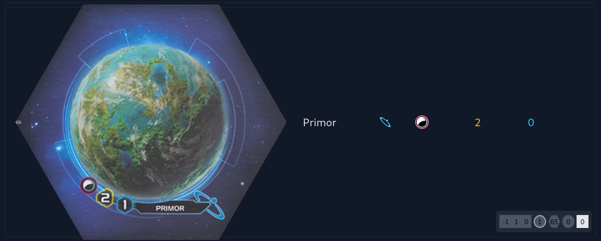

# Conclave Map Generator

Conclave is a map generator for Twilight Imperium 4th Edition. Features include:

- Supports PoK and base game
- Good map legibility tools - see breakdown of player slices, res/inf balance at a glance
- Intuitive generation options 
- Share maps via link or high-res screenshot
- Import/Export TTS strings

See it live [here](https://conclave.mistake-not.net).

## Development

The app is written in [Clojurescript](https://clojurescript.org/), uses the [re-frame](https://day8.github.io/re-frame/) frontend framework, and is built using [shadow-cljs](https://github.com/thheller/shadow-cljs).

### Running the app

The app is built using shadow-cljs, so you will need the pre-requisites listed [here](https://shadow-cljs.github.io/docs/UsersGuide.html#_installation); node.js v6.0.0 or higher, npm or yarn, and Java SDK version 11 or higher.

First install the necessary packages

```bash
cd projects/conclave
npm install #or yarn install
```

Note that `package.json` only contains the javascript packages. The clojure dependencies can be found in the `deps.edn` file (see [here](https://clojure.org/guides/deps_and_cli) for more about deps).

You can run the app via shadow-cljs directly:

```bash
npm run shadow:watch
```

This will start the app on localhost:8000 by default, and also provides a build server at localhost:9630. Changes that you make to the code should be hot reloaded into your browser. The app uses tailwind for styling, so if you want to mess around with that you'll need to run:

```bash
npm run tailwind:watch
```

### App structure

This app is a pet project, so the app structure is idiosyncratic to say the least! I would expect it to be challenging to navigate for anyone not familiar with clojure/re-frame, (and even then it might not be easy!). I am very happy to answer questions if you have any.

### Adding Map layouts

One thing that I tried to make easy (or at least not hard) is adding new layouts, and I would definitely welcome PRs adding new ones. I've tried to write the balancing algorithm in a layout-agnostic way so it should hopefully give results that are at least 'not bad'. Layouts are defined in `src/main/conclave/data/layouts.cljc`, written in [edn](https://github.com/edn-format/edn) (clojure's native data format - think of it as kinda like json but better).

To add a layout add something like this to the layouts namespace:

```clojure
(def your-map-layout ;; 'def' allocates a top-level variable, variable names are kebab-cased
  {:name "Layout name" ;; A human-readable name, it will appear in the layout select input as this
   :code "yml" ;; a short, unique name for the map, used internally
   :pok true ;; whether the map is only possible using PoK tiles (if it's not present it's considered false)
   :radius 4 ;; the number of rings of tiles around Mecatol
   :type-counts {:blue 1 :red 1} ;; The total number of blue/red tiles on the map
   :fixed-tiles [] ;; The tiles that are fixed in place (usually Mecatol, it should be possible to fix other tiles in place, but I haven't actually tested this works)
   :blank-coordinates [] ;; Not all coordinates in each ring will have a tile on them
   :hyperlane-tiles [] ;; (optional), any hyperlane tiles on the map
   :home-tiles []}) ;; The tiles for each player home system
```
**Coordinates**: are specified as 3-dimensional hex coordinates - a triple of integers. There is an excellent tutorial on hex coordinates [here](https://www.redblobgames.com/grids/hexagons/#coordinates), or you can look at the bottom right corner of the tile preview in the conclave app, the first three numbers are the hex coordinate.



**Tiles**: several of the map keys above reference tiles. A tile is a map with the structure:

```clojure
{:coordinate [0 0 0] ;; a hex coordinate, see above
 :key :18 ;; the key is either the number of the tile as a clojure keyword (e.g. :18 for mecatol, :65 for primor, hyperlane keys have A or B at then end to denote which side they are e.g. :91A and :91B), OR p and an integer to denote a home tile (e.g. :P1, :P2 etc.)
 :rotation 0};; (optional, only needed for hyperlanes) a number between 0 and 5, indicating how many 30deg rotations the tile should get
```

There are many existing examples in the layouts namespace you can look to for guidance. Once you've created the layout, you can add the def'ed variable name to the `all` list at the end of the namespace.
